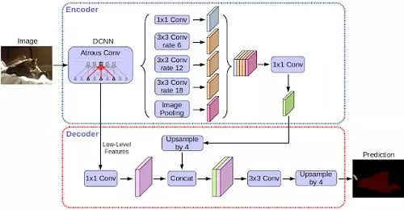

| 创建日期 |              论文入口              |
| :------: | :--------------------------------: |
| 2019.8.9 | https://arxiv.org/abs/1802.02611v1 |

## 简介

图像语义分割，简而言之就是对一张图片上的所有像素点进行分类，不同的颜色代表不同的类别。

DeepLab-v3+ 是由 DeepLab-v3 扩充而来，研究团队增加了解码器模组，能够细化分割结果，能够更精准的处理物体的边缘，并进一步将深度卷积神经网络应用在空间金字塔池化（Spatial Pyramid Pooling，SPP）和解码器上，大幅提升处理物体大小以及不同长宽比例的能力，最后得到强而有力的语义分割编码解码器网络。

## 核心思想

DeepLab-v3 +是通过添加简单而有效的解码器模块来扩展DeepLab-v3，能够细化分割结果，尤其是能够更精准的处理物体的边缘。并进一步将深度卷积神经网络应用在空间金字塔池化（Spatial Pyramid Pooling，SPP）和解码器上，大幅提升处理物体大小以及不同长宽比例的能力，最后得到强而有力的语义分割编码解码器网络。

