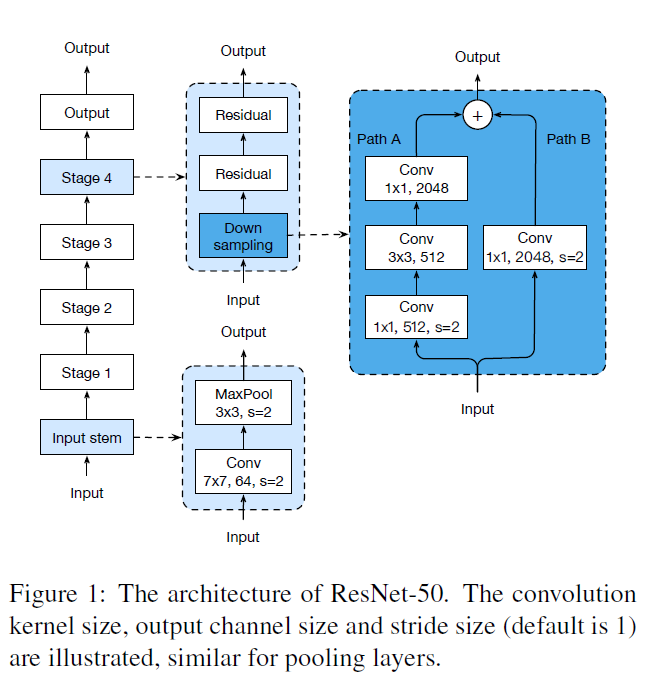
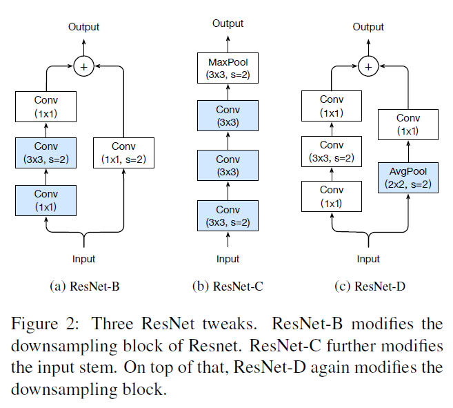
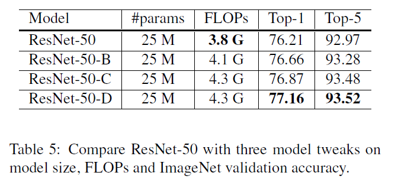
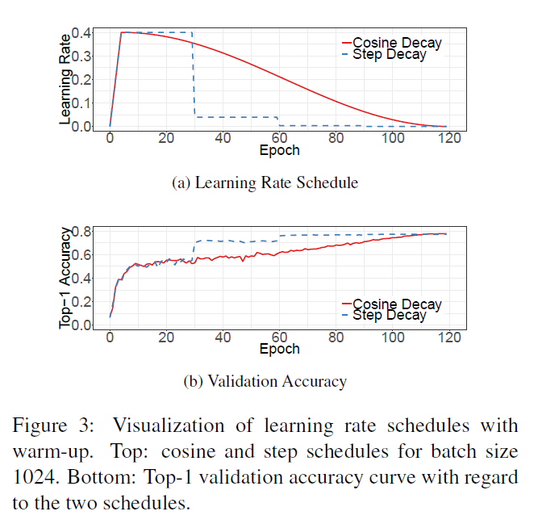
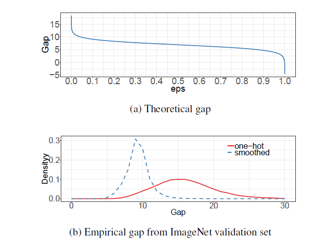
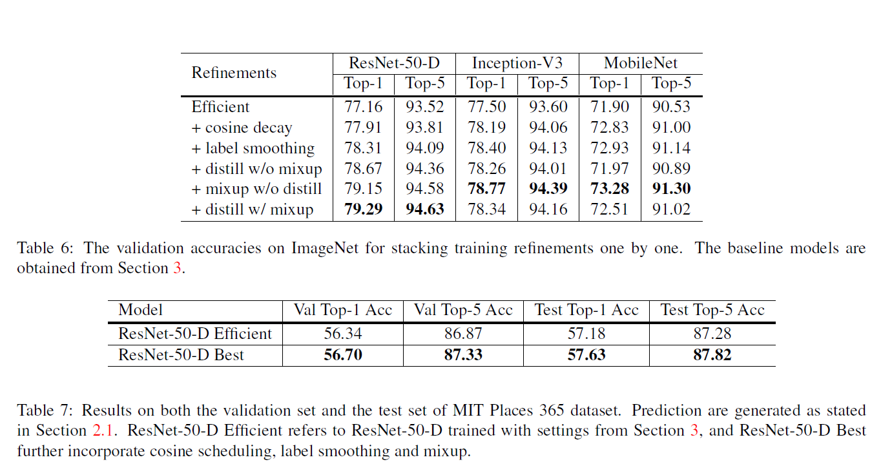
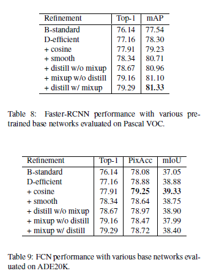

| 创建日期 |             论文入口             |
| :------: | :------------------------------: |
| 2019.8.9 | https://arxiv.org/abs/1812.01187 |

## 简介

整篇论文主要从**加快模型训练**、**网络结构优化**和**训练调优**3个部分分别介绍如何提升模型效果

## 技巧

- Warmup（constant warmup-> gradual warmup ）
- Linear scaling learning rate（big batch size）
- Label-smoothing
- Random image cropping and patching
- Zero Y（BN）
- Knowledge Distillation
- Cutout
- Random erasing
- Cosine learning rate decay
- Mixup training
- AdaBoud
- AutoAugment
- 其他经典的tricks

## 加快模型训练

* **学习率预热**

  当我们训练一个神经网络时，我们要设置学习率，这决定了模型学习的“速度”，或者我们说是我们对于来自它的预测的惩罚的积极程度。当我们开始训练我们的神经网络，我们可以期望权重有更多的随机性。如果我们设定一个积极的学习率，可能会导致网络两级分化（网路络太硬了:smile:）。

  并且网络的参数是随机初始化的，假如一开始就采用较大的学习率容易出现数值不稳定。

  为了解决这个问题，使用了学习率预热，它允许在开始时将学习率设置为较低的值，然后将学习率设置为较高的值。

* **线性缩放学习率**

  在训练神经网络时，我们在内存允许的情况下分批地将图像输入GPU。这些在SGD中是随机的，并且有一定的方差。当我们增加批的大小时，我们的批对图像的批方差减小，这允许设置更积极的学习率。也就是说，大batch size会降低梯度中的噪声，所以我们可以增大学习率来加快收敛。
  
* **随机图像裁剪和修补**

  Random image cropping and patching (RICAP)方法随机裁剪四个图片的中部分，然后把它们拼接为一个图片，同时混合这四个图片的标签。RICAP在caifar10上达到了2.19%的错误率。

* **每个残差块的最后一个BN层的γ参数初始化为0**

  BN层的γ、β参数是用来对标准化后的输入做线性变换的，也就是γx^+β，一般γ参数都会初始化为1，作者认为初始化为0更有利于模型的训练。

* **不对bias参数执行weight decay操作**

  weight decay主要的作用就是通过对网络层的参数（包括weight和bias）做约束（L2正则化会使得网络层的参数更加平滑）达到减少模型过拟合的效果。

## 优化网络结构

这部分的优化是以ResNet为例的，Figure1是ResNet网络的结构示意图，简单而言是一个input stem结构、4个stage和1个output部分，input stem和每个stage的内容在第二列展示，每个residual block的结构在第三列展示，整体而言这个图画得非常清晰了。

  

* **ResNet-B**

  改进部分就是将stage中做downsample的residual block的downsample操作从第一个11卷积层换成第二个33卷积层，如果downsample操作放在stride为2的11卷积层，那么就会丢失较多特征信息（默认是缩减为1/4），可以理解为有3/4的特征点都没有参与计算，而将downsample操作放在33卷积层则能够减少这种损失，因为即便stride设置为2，但是卷积核尺寸够大，因此可以覆盖特征图上几乎所有的位置。

* **ResNet-C**

  改进部分就是将Figure1中input stem部分的77卷积层用3个33卷积层替换。这部分借鉴了Inception v2的思想，主要的考虑是计算量，毕竟大尺寸卷积核带来的计算量要比小尺寸卷积核多不少，不过读者如果仔细计算下会发现ResNet-C中3个33卷积层的计算量并不比原来的少，这也是Table5中ResNet-C的FLOPs反而增加的原因。

* **ResNet-D**

  改进部分是将stage部分做downsample的residual block的支路从stride为2的11卷积层换成stride为1的卷积层，并在前面添加一个池化层用来做downsample。这部分我个人理解是虽然池化层也会丢失信息，但至少是经过选择（比如这里是均值操作）后再丢失冗余信息，相比stride设置为2的1*1卷积层要好一些。

## 模型训练调优

* **学习率衰减策略采用cosine函数**

  这部分的实验结果对比可以参考Figure3，其中(a)是cosine decay和step decay的示意图，step decay是目前比较常用的学习率衰减方式，表示训练到指定epoch时才衰减学习率。(b)是2种学习率衰减策略在效果上的对比。

  
* **标签平滑**

  在分类问题中，我们的最后一层一般是全连接层，然后对应标签的one-hot编码，即把对应类别的值编码为1，其他为0。这种编码方式和通过降低交叉熵损失来调整参数的方式结合起来，会有一些问题。这种方式会鼓励模型对不同类别的输出分数差异非常大，或者说，模型过分相信它的判断。但是，对于一个由多人标注的数据集，不同人标注的准则可能不同，每个人的标注也可能会有一些错误。模型对标签的过分相信会导致过拟合。
  
  标签平滑(Label-smoothing regularization,LSR)是应对该问题的有效方法之一，它的具体思想是降低我们对于标签的信任，例如我们可以将损失的目标值从1稍微降到0.9，或者将从0稍微升到0.1。
  
  

* **知识蒸馏（knowledge distillation）**

  这部分其实是模型加速压缩领域的一个重要分支，表示用一个效果更好的teacher model训练student model，使得student model在模型结构不改变的情况下提升效果。作者采用ResNet-152作为teacher model，用ResNet-50作为student model，代码上通过在ResNet网络后添加一个蒸馏损失函数实现，这个损失函数用来评价teacher model输出和student model输出的差异。

* **引入mixup**

  mixup其实也是一种数据增强方式，假如采用mixup训练方式，那么每次读取2张输入图像，假设用（xi，yi）和（xj，yj）表示，那么通过下面这两个式子就可以合成得到一张新的图像（x，y），然后用这张新图像进行训练，需要注意的是采用这种方式训练模型时要训更多epoch。

