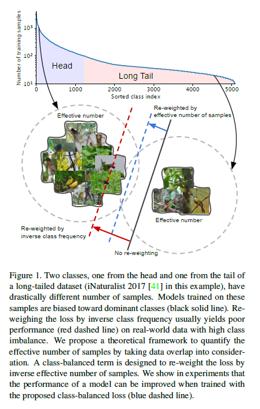
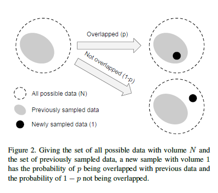
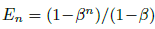
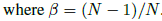
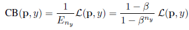

| 创建日期 |             论文入口             |
| :------: | :------------------------------: |
| 2019.9.8 | https://arxiv.org/abs/1901.05555 |

## 简介

提出了一种针对最常用损耗（softmax-cross-entropy，focal loss等）的分类重新加权方案，可以快速提高准确性，尤其是在处理高级别不平衡的数据时。

## 问题

在处理长尾数据集时（大多数样本属于很少的类而其他许多类的支持很少），决定如何权衡不同类的损失可能会很棘手。通常，权重设置为类支持的倒数或类支持的平方根的倒数。

但是，如上图所示，这会超调，因为**随着样本数量的增加，新数据点的额外好处会减少**。新添加的样本很可能是现有样本的近似重复，主要是在训练神经网络时使用大量数据增加（例如重新缩放，随机裁剪，翻转等）。通过有效样本数重新加权可获得更好的结果。

## 核心思想

有效样本数量（每个样本的贡献），假设新样本仅以两种方式与先前采样数据的量相互作用：完全覆盖或完全覆盖（如上图所示）。通过这种假设，可以使用归纳法轻松证明下述表达式

使用有效样本数量的概念，可以解决数据重叠的问题。

