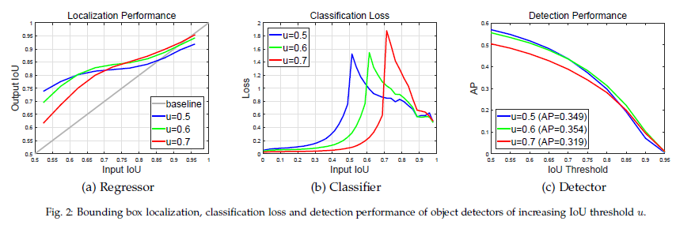
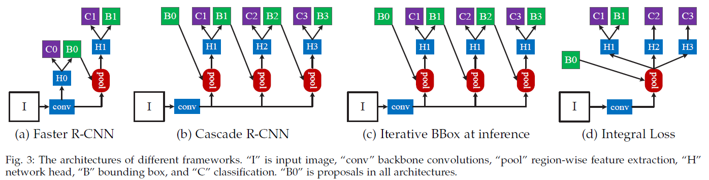
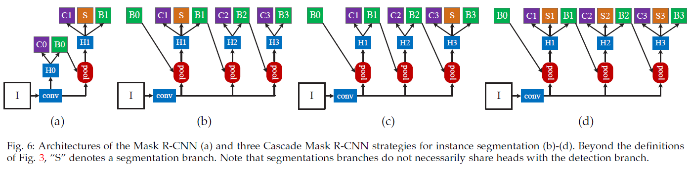

| 创建日期 |             论文入口             |
| :------: | :------------------------------: |
| 2019.8.7 | https://arxiv.org/abs/1712.00726 |

在目标检测的实验中，借助于骨干网ResNeXt-152 的加持，在COCO数据集上AP达到50.9，超越之前的SOTA TridentNet算法的48.4，在实例分割实验中精度也显著高于Mask R-CNN。

### 问题

图1（a）给出了经过一次回归以后目标候选框与真实目标框匹配的IoU的变化，横轴代表回归前，纵轴代表回归后，不同颜色的曲线反映的是不同IoU阈值训练的检测器。总体而言，经过回归器以后，目标候选框的IoU均有所提升，但区别在于：IoU在0.55-0.6之间时，基于0.5的IoU阈值训练的回归器输出最佳（蓝色线）；IoU在0.6-0.75之间，基于0.6的IoU阈值训练的回归器输出最佳（绿色线）；IoU在0.75以上，基于0.7的阈值训练出的回归器输出最佳（红色线）。

以上结果表明：要得到定位精度较高的检测器（也即IoU越大越好），就必须选用较大的IoU阈值，然而图1（d）的结果表明，基于0.7的阈值训练出的检测器（红色线）的AP反而是最差的，只有在选用IoU阈值为0.85以上进行评测时，其结果才略好于蓝色线，但依然劣于绿色线，充分验证了我们之前的分析：基于0.7的IoU阈值训练出的检测器中正样本过少，因此正样本的diversity不够，容易导致训练的过拟合，因此在验证集上表现不佳。进而作者思考，能否有一种方式既可以用较高的IoU阈值训练检测器，又能够保证正样本的diversity足够丰富？基于以上分析，下面我们详细论述上作者所提出的Cascade R-CNN，其核心思想就是‘分而治之’。

### 核心思想

使用不同的IOU阈值，训练多个级联的检测器。它可以用于级联已有的检测器，取得更加精确的目标检测。

### Cascade R-CNN 网络结构

图3给出了本文方法和其他相关工作的直观对比。（b）展示的就是本文Cascade R-CNN的基本框架；(a)就是经典的Faster R-CNN框架，也是本文的baseline；（c）结构上和Cascade R-CNN非常相似，区别在于只在测试时采用级联结构对Box多次回归，因此ROI检测网络部分“H1”结构是相同的，也即训练时还是采用的单一的IoU阈值；（d）则是在ROI检测网络部分并联多个检测器，这些检测器是不相关的，有点类似‘multi-expert’的思想。

### Cascade Mask R-CNN 网络结构

受Mask R-CNN发，作者将Cascade R-CNN推广到实例分割很简单，作者提供了三种策略，分别对应下图中b、c、d中将分割头S放在不同的位置。